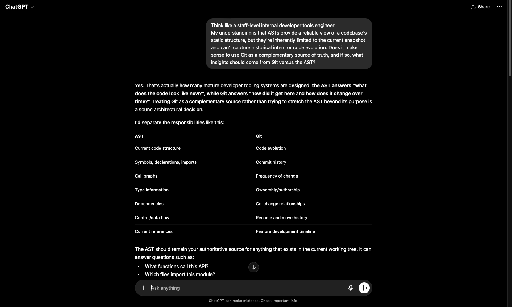
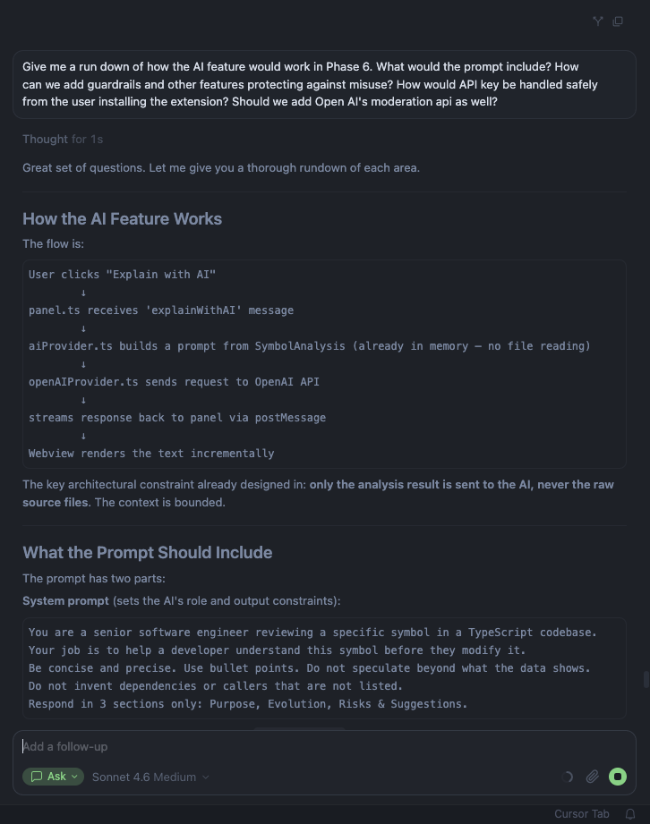

# Arkaeo (VS Code Extension)

Your own personal codebase archaeologist. Understand the whole history of a TypeScript symbol before you change anything - without leaving the editor.

Place your cursor inside any function, method or class. Arkaeo shows you a clean dependency graph, full git history, and a risk score in the form of an easy-to-use side panel. Optionally, get a focused AI summary of what the symbol does, how stable it is and what to watch out for before editing.


## 1. Install and run from source:

**Prerequisites:** Node.js 18+, VS Code 1.85+, Git

```bash
git clone https://github.com/<your-handle>/arkaeo
cd arkaeo
npm install
npm run compile
```

Open the folder in VS Code and press **F5**. A new Extension Development Host window opens with Arkaeo active.

To run tests:

```bash
npm test
```

**Set an API key (optional - only needed for AI summaries):**

Open the Command Palette and run `Arkaeo: Set Anthropic API Key`. The key is stored in VS Code's secret storage, never in settings or on disk.


## 2. What it does and what problem it solves:

Developers context-switch constantly before editing shared code - opening git blame, grepping for callers, reading unfamiliar files to gauge blast radius. Arkaeo collapses that into a single command.

**Trigger:** Click the "Analyze with Arkaeo" CodeLens that appears above any symbol, or run `Arkaeo: Analyze Symbol` from the Command Palette. (Ctrl/Cmd + Shift + P)

**The panel shows:**

- **Dependency graph** - what the symbol imports and what files call it, with one-click expansion to see callers of callers
- **Architecture** - full import/export list, function signature
- **Risk score** - deterministic 0–100 score based on reference count, commit churn, TODO markers, recency, and author spread
- **Git history** - commit count, primary author, first introduced, last modified, recent commit log, and change coupling (files that are always committed alongside this one)
- **AI summary** - three focused bullets: what it does, what git history reveals, and what to watch before editing (requires Anthropic API key, can be added through Command Palette - Ctrl/Cmd + Shift + P.)

Arkaeo supports TypeScript and TSX files. The CodeLens can be disabled via the `arkaeo.showCodeLens` setting.


## 3. The hardest problem I ran into and how I solved it:

Although it was challenging at times, the hardest problem wasn't technical choices. It was managing information density and overload. Arkaeo collects a lot of data per symbol: dependency edges, git commits, author stats, risk factors, co-change relationships, imports, exports and signature details. Showing all of it at once would be confusing, not insightful.

The solution was progressive disclosure level-by-level:

- **Quick metrics bar** - four numbers at a glance (referenced by, dependencies, commits, last modified) before anything else, highlighted by visual hierarchy rules.
- **Collapsible sections** - risk and Architecture open by default, other sections remain collapsed and kept available on demand, even though those sections provide high quality insights as well.
- **AI summary hidden behind a button** - not auto-triggered, not forced. Removes visual clutter and results in lower wasted tokens.
- **Dependency graph first** - the visual gives spatial orientation; the dependency list is there if you need the detail
- **CodeLens, instead of Command Palette** - the entry point is contextual and appears above the specific symbol the user has clicked on, reducing usage friction and encouraging codebase research ahead of making changes.

The principles used throughout this process it to show the answer to "should I alter this?" immediately and make everything else one click away and friction-less.


## 4. LLM conversation:

Here are two conversations (ChatGPT for brainstorming & Cursor for mid-development optimization) that shaped real decisions in this project:

**ChatGPT - AST vs Git as data sources**

Used ChatGPT to brainstorm whether to treat Git as complementary to the AST or let one own all analysis. Led to keeping `astAnalyzer.ts` and `gitAnalyzer.ts` as separate, non-overlapping modules.



**Cursor - prompt engineering for the AI summary**

Used Cursor's aid for optimizing the data that needs to be passed, bounding the context window and constraining output format. Shaped `prompts.ts` - structured analysis data only with strict three-section output. Raw source was never sent, ensuring codebase privacy.




## 5. What would I build next:

- **Bundling** - `ts-morph` ships the full TypeScript compiler, making the extension ~10 MB. Replacing `tsc` with `esbuild` would bring it under 1 MB.
- **JavaScript/JSX support** - the AST layer uses ts-morph which can handle JS with a config change; the rest of the pipeline would carry over unchanged.
- **Multi-provider AI** - the `AiProvider` interface is already in place. Adding OpenAI or a local model (Ollama) would just require quick rewiring, no foundational architectural changes needed.
- **Inline risk decorations** - show risk level as a gutter icon directly in the editor, without opening the panel.
- **Panel history** - a back/forward stack so you can compare two symbols side by side.
